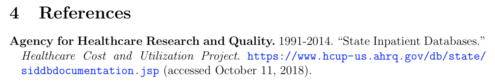

# AEA-Style References with BibTeX and Zotero
This guide is designed for Zotero users who would like to use the official [AEA BibTeX style](https://www.aeaweb.org/journals/policies/templates) to automatically export properly formatted online references. **Feedback welcome!**

In particular, this approach should ensure the correct formatting for the following:
* Year ranges (e.g., 2011-2014);
* Organizations as authors;
* Website titles; and
* URLs and access dates.

## Install the Better BibTeX Zotero Plug-In
Assuming you have already installed [Zotero](https://www.zotero.org), go ahead and also install the [Better BibTeX](https://github.com/retorquere/zotero-better-bibtex) plug-in. The principal benefit of this plug-in is that it allows any change in Zotero (i.e., the addition of a new reference) to be mirrored instantaneously in a linked `.bib` file. For our purposes here, the plug-in also provides granular control over the format of exported `.bib` files, including citation keys and item fields.

## Customize Better BibTeX
The Better BibTeX translator needs to be customized to ensure that data fields for online references are exported appropriately. Navigate to the Better BibTeX advanced preferences pane (Zotero -> Preferences -> Better BibTeX -> Advanced) and paste in the code below as “postscript”:

```javascript
if (Translator.BetterBibTeX && item.itemType === 'journalArticle') {
    if (item.shortTitle) {
      this.add({name: 'author', replace: true, bibtex: "{{" + item.shortTitle + "}}" });
    }
    if (item.date) {
      this.add({name: 'year', replace: true, bibtex: "{" + item.date + "}" });
    }
    if (item.extra) {
      this.add({ name: 'note', replace: true, bibtex: "{\\url{" + this.enc_verbatim({value: item.url}) + "}" + " (accessed " + item.extra + ")" + "}" });
    }
  }
```

## Install the AEA BibTeX Style
Install `aea.bst` (available [here](https://www.aeaweb.org/journals/policies/templates)) in your local BibTeX style folder.

## Adding Online References to Zotero
When you add an online reference, make sure the Zotero item type is “Journal Article,” not “Web Page.” Enter the title for the specific web page as “Title” (e.g., “State Inpatient Databases”) and the overall website title — if there is a separate one — as “Publication” (e.g., “Healthcare Cost and Utilization Project”). Human author names should be specified as they would normally in the “Author” field.  If the website’s author is an organization, enter that name as the “Short Title.” Enter the year the website was last updated in “Date,” the URL in “URL,” and the date you last accessed the website in the "Extra" field with proper formatting (e.g., “October 11, 2018”).

## Setting Up LaTeX
Be sure you have enabled the `hyperref` and `natbib` packages in your preamble. Specify `aea` as the bibliography style.

```latex
\usepackage[colorlinks = true,
            linkcolor = blue,
            urlcolor  = blue,
            citecolor = blue,
            anchorcolor = blue]{hyperref}
\usepackage[round]{natbib}
\bibliographystyle{aea}
```

Don’t forget to call your `.bib` file at the end of your document (`\bibliography{refs}`).

The result should look something like this in your bibliography:


